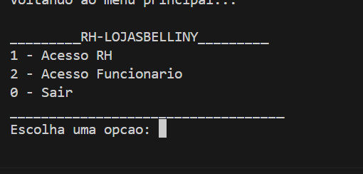
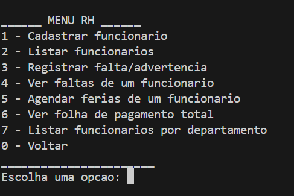
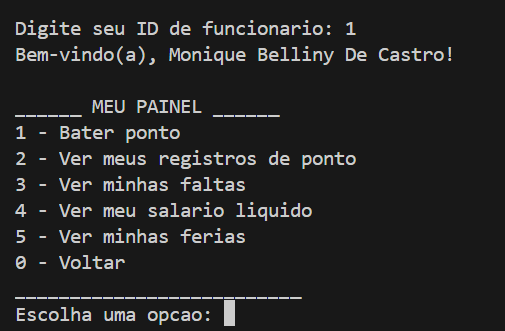
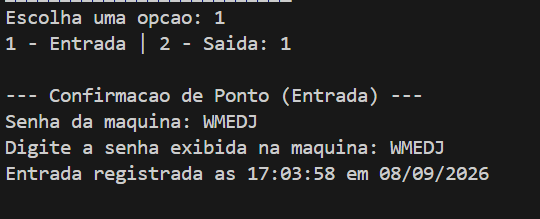

# RH-LojasBelliny

Projeto individual de disciplina de C++.
Sistema de gestão de RH desenvolvido em C++, simulando o painel de recursos humanos de uma loja. 

## Sobre o projeto

O sistema simula um ambiente real de RH com dois níveis de acesso: um painel administrativo (RH), que gerencia todos os funcionários, e um painel individual (Funcionário), onde cada colaborador acessa apenas os próprios dados — incluindo os próprios integrantes do time de RH, que também são funcionários cadastrados no sistema.

### Menu principal


## Funcionalidades

**Acesso RH**
- Cadastro de funcionários (nome, cargo, departamento, salário base)
- Listagem de todos os funcionários
- Registro de faltas (com ou sem atestado) e advertências
- Consulta de faltas por funcionário
- Agendamento de férias
- Cálculo da folha de pagamento total da empresa
- Filtro de funcionários por departamento

### Menu RH


**Acesso Funcionário**
- Login simples via ID
- Registro de ponto (entrada/saída) com hora capturada automaticamente e confirmação por senha aleatória de 5 letras (simulando a senha exibida na máquina da empresa)
- Consulta dos próprios registros de ponto
- Consulta das próprias faltas
- Cálculo do próprio salário líquido (com INSS e IR calculados de forma progressiva)
- Consulta das próprias férias agendadas

### Menu Funcionário


### Confirmação de ponto com senha



## Paradigmas e estruturas utilizadas

- **Paradigma imperativo:** fluxo principal do sistema, cadastro e registro sequencial de dados
- **Paradigma funcional:** lambdas combinadas com funções da STL — `std::accumulate` (folha de pagamento), `std::count_if` (contagem de faltas injustificadas), `std::copy_if` (filtro de férias próximas e de funcionários por departamento)
- **Estruturas de condição:** `if/else` (validação de senha, faixas de desconto de INSS/IR) e `switch/case` (menus principal, RH e funcionário)
- **Estruturas de repetição:** `for` (listagens), `while`/`do-while` (loop dos menus e tentativas de senha)
- **Funções em C++:** cada operação implementada como função separada e reutilizável entre os módulos

## Arquitetura

Sistema modularizado, com cada área de responsabilidade separada em um par de arquivos `.h`/`.cpp`:

```
sistema-rh/
├── src/
│   ├── main.cpp
│   ├── funcionario.cpp
│   ├── ponto.cpp
│   ├── falta.cpp
│   ├── salario.cpp
│   └── ferias.cpp
├── include/
│   ├── funcionario.h
│   ├── ponto.h
│   ├── falta.h
│   ├── salario.h
│   └── ferias.h
└── .vscode/
    ├── tasks.json      (compilar com um atalho)
    └── launch.json     (rodar/debugar)
```

| Módulo | Responsabilidade |
|---|---|
| Funcionario | Cadastro, listagem, busca e filtro por departamento |
| Ponto | Captura de hora, geração de senha aleatória e registro de ponto |
| Falta | Registro de faltas/advertências e contagem de dias trabalhados |
| Salario | Cálculo de salário líquido com INSS e IR progressivos |
| Ferias | Agendamento e consulta de férias por funcionário |

## Como compilar e executar

Requer G++ (MinGW/MSYS2) com suporte a C++17.

```bash
g++ -std=c++17 src/*.cpp -Iinclude -o sistema-rh
./sistema-rh
```

Ou, no VS Code, use `Ctrl+Shift+B` para compilar e rode o executável gerado pelo terminal integrado.

## Autora

Monique